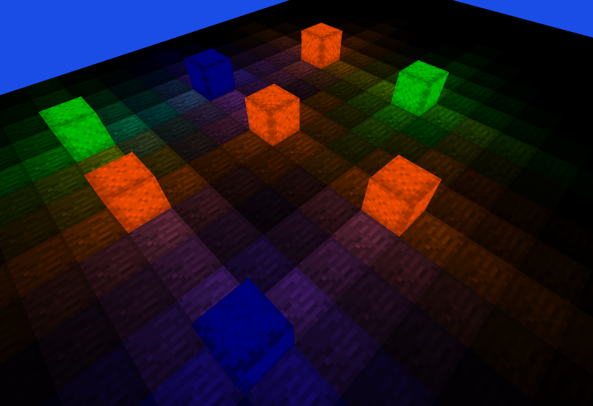

# Lightweight Game Engine/Template

I frequently find myself struggling to scale projects as the codebase becomes too messy or specialized to its current self. I also find that when starting new projects or rewriting old ones, I am struggling to relearn or reuse core library functions from OpenGL, as an example. The purpose of this project is to provide myself with a scalable foundation for developing games and applications in general. 

All of the complicated OpenGL functions are hidden inside the engine behind easy-to-understand functions for initializing, meshing, and drawing. 

Furthermore, this engine/template has a screen and on-screen button framework built in already.

## Voxel Lights Example (made with this engine):



## Requirements

- GLFW (`brew install glfw`)
- GLAD and stb_image placed in this repository as follows:

```text
vendor/
  glad/include/glad/gl.h
  glad/src/gl.c
  stb/stb_image.h
```

## Build and run

For macOS, use the following commands:

```sh
g++ -std=c++17 \
  app/*.cpp \
  app/app_controls/*.cpp \
  app/app_screen/*.cpp \
  engine_v2/engine_core/*.cpp \
  engine_v2/engine_platform/*.cpp \
  engine_v2/engine_render/*.cpp \
  vendor/glad/src/gl.c \
  -Ivendor/glad/include \
  -Ivendor/stb \
  -I/opt/homebrew/include \
  -L/opt/homebrew/lib \
  -lglfw \
  -framework Cocoa \
  -framework OpenGL \
  -framework IOKit \
  -o game

./game
```
