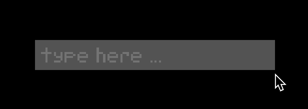
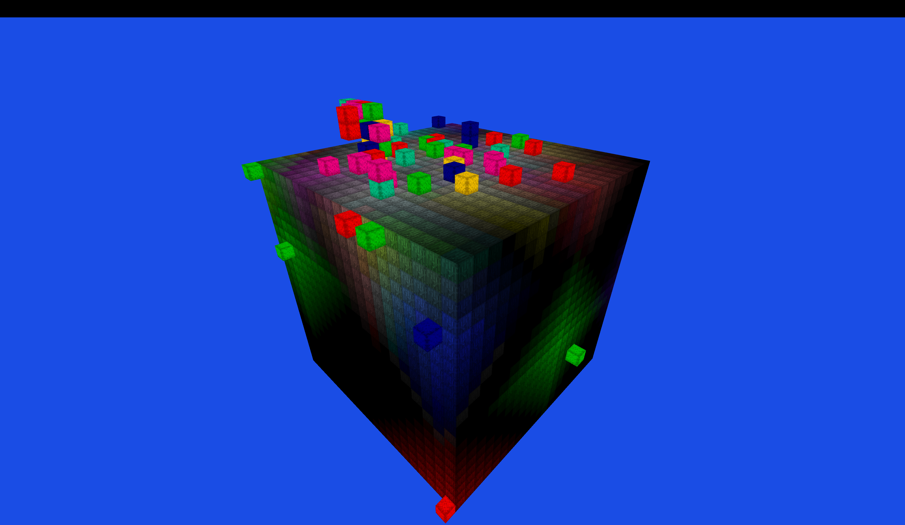

# Lightweight Game Engine/Template

A lightweight C++/OpenGL foundation for games and applications. It simplifies initialization, meshing, and rendering while providing built-in screen management and on-screen buttons.

I found myself struggling to scale application projects, and also struggling to start over and relearn libraries when the previous attempt's codebase became too unscalable. This game engine/template was made with the goal of resolving both of these issues. Care was taken to make this both scalable and easy to use.

As the developer, you should build your project in app/, and leave engine_v2/ largely or completely untouched. 

## Examples Made With This Engine (Not Included In Repository):





## Requirements

- GLFW (`brew install glfw`)
- GLAD and stb_image placed in this repository as follows:

```text
vendor/
  glad/include/glad/gl.h
  glad/src/gl.c
  stb/stb_image.h
```

## Build and run

For macOS, use the following commands:

```sh
g++ -std=c++17 \
  app/*.cpp \
  app/app_controls/*.cpp \
  app/app_screen/*.cpp \
  engine_v2/engine_core/*.cpp \
  engine_v2/engine_platform/*.cpp \
  engine_v2/engine_render/*.cpp \
  vendor/glad/src/gl.c \
  -Ivendor/glad/include \
  -Ivendor/stb \
  -I/opt/homebrew/include \
  -L/opt/homebrew/lib \
  -lglfw \
  -framework Cocoa \
  -framework OpenGL \
  -framework IOKit \
  -o game

./game
```
