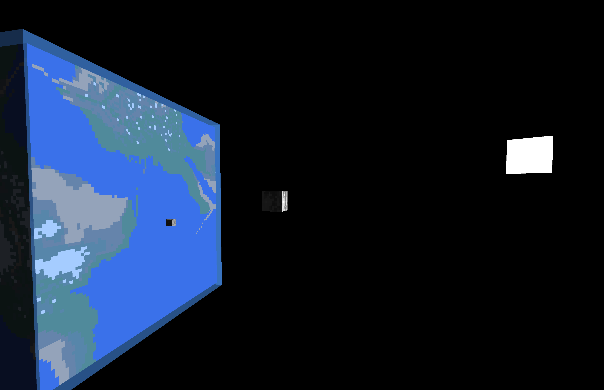
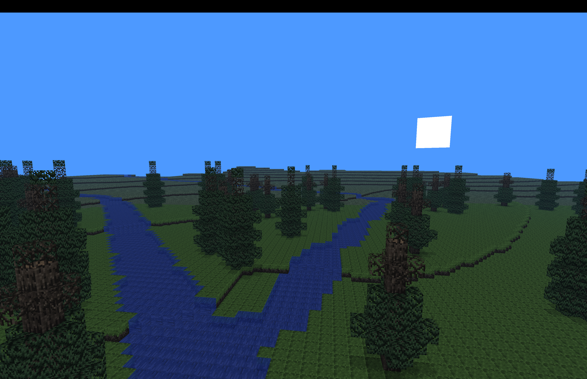
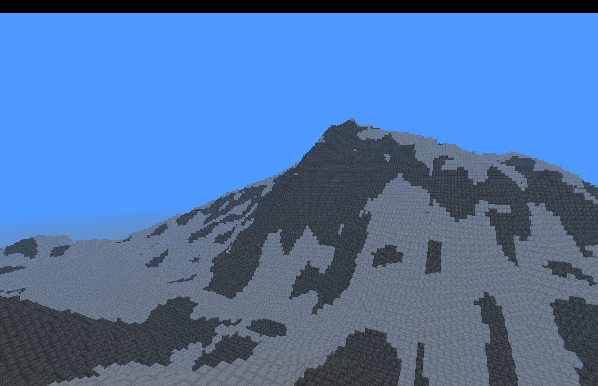

# Lightweight Game Engine

A lightweight C++/OpenGL template for games and applications. It simplifies initialization, meshing, and rendering while providing built-in screen management, on-screen buttons, and more.

I found myself struggling to scale application projects, and also struggling to start over and relearn libraries when the previous attempt's codebase became too unscalable. This game engine was made with the goal of resolving both of these issues. Care was taken to make this both scalable and easy to use.

As the developer, you should build your project in `app/`, and leave `engine/` largely untouched. 

## Examples:

The following screenshots are taken from a current project using this game engine. 

## Requirements

- GLFW
- GLAD
- stb_image

